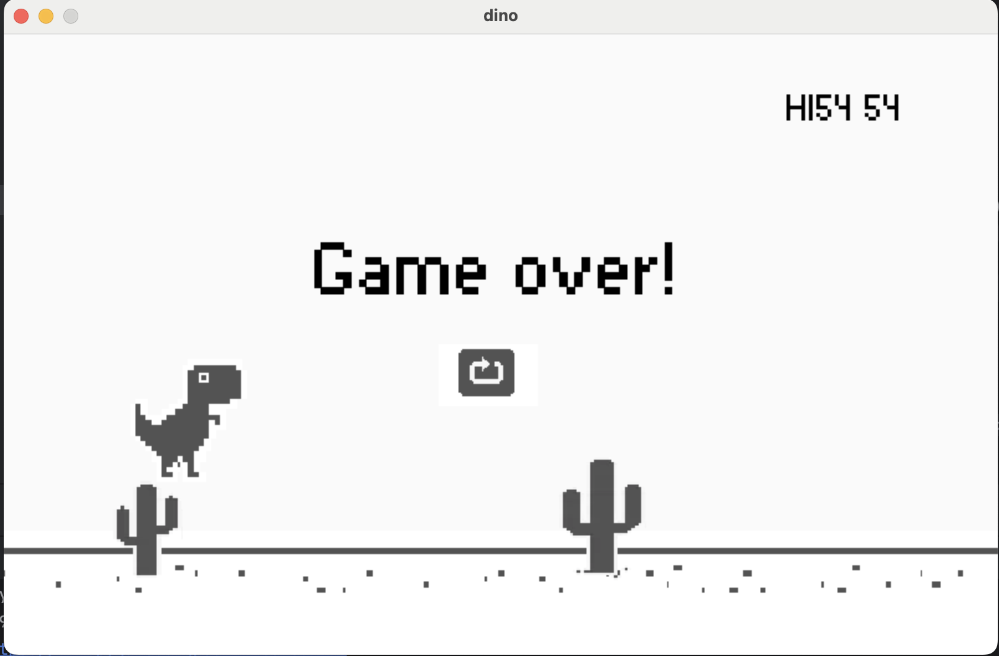

# T-Rex-Runner

# Вступ

Цей проєкт створено для учнів курсу Python Start першого року навчання. У цьому репозиторії ми реалізуємо просту гру, яка допоможе учням зрозуміти базові концепції програмування і використання бібліотеки Pygame. Метою гри є навчання основ програмування, таких як робота зі спрайтами, анімаціями, обробка подій, та створення інтерактивної гри.

## 🎮 Огляд проєкту

T-Rex-Runner — це нескінченний раннер, в якому гравець керує динозавром, що повинен уникати перешкод у вигляді кактусів. Основні елементи гри включають:
- **Гравець**: динозавр, який може бігати і стрибати для уникнення перешкод.
- **Перешкоди**: кактуси, які з'являються випадково і рухаються в бік гравця.
- **Складність**: поступово зростає, оскільки швидкість гри збільшується, що робить гру дедалі важчою.
- **Рахунок**: кількість очок, яку гравець набирає в залежності від того, як довго він може уникати перешкод.

Цей проєкт розрахований на новачків і покликаний допомогти учням розвинути свої навички в Python, а також навчитися основам створення 2D-ігор.

## 📂 Етапи розробки

Проєкт поділений на кілька етапів, кожен з яких має свою окрему гілку в репозиторії:
1. **Етап 1: Створення основних елементів гри** — додамо спрайти, як-от гравець і перешкоди, та базову механіку руху.
2. **Етап 2: Реалізація стрибка гравця** — навчимося керувати рухом гравця за допомогою клавіш.
3. **Етап 3: Перешкоди та їхній рух** — додамо перешкоди, як-от кактуси, та механіку їхнього появи.


## 🔗 Як почати

1.**Встановити залежності**: переконайтеся, що у вас встановлено бібліотеку Pygame. Ви можете встановити її за допомогою команди:
   ```bash
   pip install pygame
   ```


## 🔍 Подальші плани

Проєкт з кожним етапом буде розширюватися новими функціями, такими як анімації персонажів, додавання нових перешкод і навіть створення більш складних рівнів. Це надасть учням можливість поступово опановувати більш складні концепції програмування.

Ми сподіваємося, що цей проєкт допоможе вам навчитися новому, весело провести час і створити щось, чим можна пишатися!

